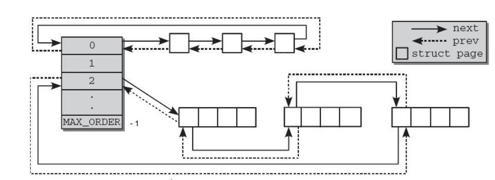
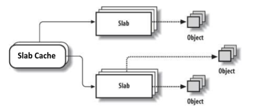
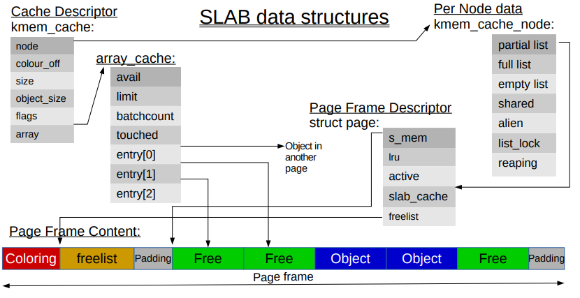
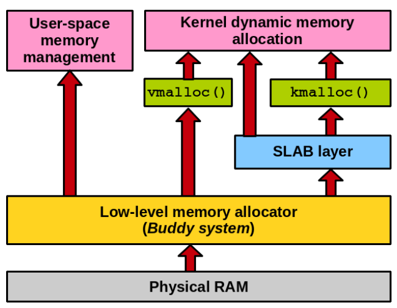

# ```#include <linux/slab.h>```

Author: Andrea Di Dio

If you have any further questions or suggestions after reading this writeup feel free to contact me at a.didio@student.vu.nl or on Twitter (@hammertux). I will try to answer any questions or adopt any suggestions :)

## Introduction

Seen as the Slab allocator is a fairly hard and advanced topic to grasp, I thought it would be nice for you to have a writeup of what has been covered in the lecture slides. I will briefly explain what the buddy allocator is in order to make it clear why a slab allocator is handy in the linux kernel and then continue with a more detailed explanation of the slab allocator(s). This writeup has been written based on the 5.3.13 Linux kernel (latest stable release at the time of writing --- _Fri 15 Nov 22:13:17 CET 2019_). I will illustrate what happens on x86-64 systems in which the page sizes are:

* Normal Pages: 4KB (defined as the PAGE\_SIZE constant in the kernel).
* Huge Pages: 2MB or 1GB.

## The Buddy Allocator

The basic idea of a buddy allocator is fairly simple. Physical memory is broken up into large chunks of memory where each chunk is a _"page order"_ (i.e., $2^n * PAGE\_SIZE$). Whenever a block of memory needs to be allocated and the size of it is not available, one big chunk is halved continuously, until a chunk of the correct size is found. At this point, of the two halves, also known as __buddies__, one will be used to satisfy the allocation request, and the other will remain free. At a later stage, if and when that memory is free'd, the two buddies (if both free) will coalesce forming a larger chunk of free memory.

_Note: Linux uses a buddy allocator for each memory zone. You are not necessarily expected to understand the notion of a memory zone. Generally speaking there will be DMA and DMA32 zones, highmem zone and a Normal zone and other zones (e.g., Zone Movable).

The buddy allocator keeps track of free areas via an array "queues" of type `struct free_area` which keeps track of the free chunks (in reality we are talking about page frames --> `struct page`). It goes from 0 (min order) to 10 (MAX\_ORDER - 1).

```c
struct free_area {
		struct list_head free_list[MIGRATE_TYPES];
		unsigned long nr_free;
};

```

Note that the buddy allocator (and the slab allocator) allocate physically contiguous memory blocks. The third allocator in the linux kernel, vmalloc() (which won't be discussed) on the other hand, allocates memory that is ONLY virtually contiguous but not necessarily physical. It is primarily used for very large allocations, and cannot be used in cases where virtual addressing is not possible (e.g., devices)



Page frames are allocated and free'd in the kernel using the following procedures:

```c

static inline struct page *alloc_pages(gfp_t gfp_mask, unsigned int order); // "linux/gfp.h"

/*
 * e.g., to request one page: struct page *page = alloc_pages(GFP_KERNEL, 0);
 */

void free_pages(unsigned long addr, unsigned int order); // "linux/page_alloc.c"


```

Both functions take the order as the parameter to see which queue to look for. If the queue is empty, the buddy allocator will search for queues in the bigger "orders" to split a block into two buddies and allocate the requested pages.

The GFP (Get Free Page) mask that is in the `alloc_pages` signature represents a set of flags that can be combined to represent who requests the memory allocation: e.g., `GFP_KERNEL` is used when allocating page frames for use in the kernel, `GFP_USER` is for userspace allocations, etc... (For a complete list of the GFP flags, see `include/linux/gfp.h`).

As it might be clear by now, the buddy allocator has one big problem. Say we want to allocate 33 pages. Seen as the buddy allocator works with the order queues explained above, the minimum amount of pages we can get is $2^6 = 64$ because $33 > 2^5 (=32)$. This _"wastes"_ 31 pages (i.e., for an allocation of 33 pages, we would have an overhead of $\frac{31}{64} * 100 = 48\%$). This is also known as __internal fragmentation__. This problem in Linux is addressed using the __slab allocator__ which slices pages into smaller blocks of memory (slabs) for allocation.

_Note that in reality, the linux kernel maintainers have optimised the buddy allocator by defining page mobility (i.e., **some** pages are reclaimable or movable) which reduces the overhead discussed above, however this is outside the scope of this writeup_ (if interested see the definition of `enum migratetype` in "linux/mmzone.h").

## The Slab Allocator

The slab allocator in linux sits on top of the buddy allocator and the basic idea behind it is to keep caches of commonly used objects available for allocation in the kernel. This is particularly useful because the linux kernel allocates and frees many structures continuously (for example, the `struct task_struct` which is the structure that represents a process, `inodes`, `dentries`, etc...). By caching the freed object, it is possible for the basic structure to be preserved betweeen uses thus allowing for quick allocation of new copies of the same structures. I.e., By reusing the freed objects, in some cases, the kernel doesn't necessarily have to reinitialise them from scratch. Over the years (and many kernel versions...) the linux slab allocator has evolved, and changed substantially. there have been three different implementations to this day:

1. __SLOB Allocator__: Now used for embedded systems where memory is scarce, performs well when allocating very small chunks of memory.
2. __SLAB Allocator__: An improvement over the SLOB allocator, aims to be very _"cache-friendly"_.
3. __SLUB Allocator__: Has better execution time than the SLAB allocator by reducing the number of queues/chains used.

Nowadays (depending on the distribution you are using e.g., Debian-based) the default Slab allocator is the SLUB allocator.

_Note: The generic "Slab Allocator" term can be used to refer to all three alllocators. Whenever there is the need to make a clear distinction between the allocators, I will write SLOB, SLAB or SLUB in capital letters._

A slab cache contains multiple slabs which in turn, contain multiple objects. The general organisational overview can be seen below:



### __Caches__

The slab allocator provides two main classes of caches:

1. __Dedicated__: These are caches that are created in the kernel for commonly used objects (e.g., `mm_struct`, `vm_area_struct`, etc...). Structures allocated in this cache are initialised and when they are freed, they remain initialised so that the next allocation will be faster.
2. __Generic__ (_size-N_ and _size-N(DMA)_): These are general purpose caches, which in most cases are of sizes corresponding to powers of two.

This separation can be seen in the dedicated file for slab in the proc file system:

```bash
sudo cat /proc/slabinfo #I will only show partial output for brevity

# name <active_objs> <num_objs> <objsize> <objperslab> <pagesperslab> : tunables <limit> <batchcount> <sharedfactor> : slabdata <active_slabs> <num_slabs> <sharedavail>


vm_area_struct     65543  66082    208   19    1 : tunables    0    0    0 : slabdata   3478   3478      0
mm_struct            213    225   2112   15    8 : tunables    0    0    0 : slabdata     15     15      0
files_cache          228    230    704   23    4 : tunables    0    0    0 : slabdata     10     10      0
signal_cache         399    448   1024   16    4 : tunables    0    0    0 : slabdata     28     28      0
sighand_cache        414    435   2112   15    8 : tunables    0    0    0 : slabdata     29     29      0
task_struct         1102   1125   5952    5    8 : tunables    0    0    0 : slabdata    225    225      0
dma-kmalloc-256        0      0    256   16    1 : tunables    0    0    0 : slabdata      0      0      0
dma-kmalloc-128        0      0    128   32    1 : tunables    0    0    0 : slabdata      0      0      0
dma-kmalloc-64         0      0     64   64    1 : tunables    0    0    0 : slabdata      0      0      0
dma-kmalloc-32         0      0     32  128    1 : tunables    0    0    0 : slabdata      0      0      0
dma-kmalloc-16         0      0     16  256    1 : tunables    0    0    0 : slabdata      0      0      0
dma-kmalloc-8          0      0      8  512    1 : tunables    0    0    0 : slabdata      0      0      0
kmalloc-256         1801   2064    256   16    1 : tunables    0    0    0 : slabdata    129    129      0
kmalloc-192         4410   4410    192   21    1 : tunables    0    0    0 : slabdata    210    210      0
kmalloc-128         2689   2752    128   32    1 : tunables    0    0    0 : slabdata     86     86      0
kmalloc-96          6952   7350     96   42    1 : tunables    0    0    0 : slabdata    175    175      0
kmalloc-64         25933  26496     64   64    1 : tunables    0    0    0 : slabdata    414    414      0
kmalloc-32         15150  15616     32  128    1 : tunables    0    0    0 : slabdata    122    122      0
kmalloc-16         18432  18432     16  256    1 : tunables    0    0    0 : slabdata     72     72      0
kmalloc-8          10149  10240      8  512    1 : tunables    0    0    0 : slabdata     20     20      0

```

The first few lines show dedicated caches, from `dma-kmalloc-256` onwards the generic caches are listed.

`kmalloc` is the interface the kernel provides to do generic allocations through the slab allocator:

```c
// "include/linux/slab.h"
static __always_inline void *kmalloc(size_t size, gfp_t flags); //allocates memory through slab allocator.

static inline void *kzalloc(size_t size, gfp_t flags); //allocates memory (and sets it to zero like calloc() in userspace) through the slab allocator.

void * __must_check krealloc(const void *, size_t, gfp_t); //resize existing allocation.

void kfree(const void *); //frees memory previously allocated.

void kzfree(const void *);

```

Creating dedicated caches for your objects is slightly trickier and requires initialising a slab cache (`struct kmem_cache`).

I will walk you through how a dedicated slab cache can be defined and used by taking the `vm_area_struct`'s slab cache as an example:

```c
//"kernel/fork.c"

/* slab cache for vm_area_struct structures */
static struct kmem_cache *vm_area_cachep;

vm_area_cachep = KMEM_CACHE(vm_area_struct, SLAB_PANIC|SLAB_ACCOUNT);
/*
 KMEM_CACHE() is a macro defined in "/include/linux/slab.h" which actually expands to a call to kmem_cache_create() which is the procedure to register a new slab cache and adds the new cache to the list of all slabs in the system.
 */

struct vm_area_struct *vma = kmem_cache_alloc(vm_area_cachep, GFP_KERNEL);
/*
 kmem_cache_alloc() is the procedure to allocate the object from the dedicated cache memory. The allocation will be attempted first on a partially filled slab, then (if no partially filled slabs are available) in a free slab, and if no free slabs are found, it will try to allocate new page frames from the underlying buddy allocator.
 */

 kmem_cache_free(vm_area_cachep, vma);
 /*
  kmem_cache_free() is the procedure that frees the memory allocated to the vma object previously allocated. The (now free'd) slab will be kept in order to be used for future allocations and the memory is not released immediately after this call. When all of the slabs have been free'd, kernel modules have to call kmem_cache_destroy() to release the pre allocated memory.
 */
```

The three main structures that are used to manage caches in the __SLAB allocator__ are:

1. `struct kmem_cache` ("/include/linux/slab_def.h").
2. `struct kmem_cache_node` ("/mm/slab.h").
3. `struct array_cache` ("/mm/slab.c").

I have already showed that `struct kmem_cache` is exposed to the programmer in order to create a cache and allocate an object in the cache. Some fields of this structure are of particular importance:

* `unsigned int gfporder` : defines the order (in powers of two -- $2^n$) of pages per slab. This is used by the slab allocator to request memory from the buddy allocator.
* `void (*ctor)(void *obj)` : defines the constructor of the object which we want to allocate.
* `int object size` : size of the object being allocated through the slab cache.
* `size_t colour` and `unsigned int colour_off` : used for cache coloring (I will skip the details of cache coloring for the time being).
* `struct array_cache __percpu *cpu_cache` : Used to reduce the number of linked list traversals/operations. Has __LIFO ordering__ to take advantage of cache hotness and aims to hand out "cache warm" objects. The member `void *entry[]` of this structure holds an array of recently freed pointers (i.e., free'd objects which are cache hot). Note that these pointers don't preserve locality of access as the entry pointers can point to free objects in multiple page frames.
* `struct kmem_cache_node *node[MAN_NUMNODES]` : Used to keep track of slabs in different states, i.e., It keeps three linked lists (`struct list_head slabs_partial`, `struct list_head slabs_full` and `struct list_head slabs_free`) where each list holds, respectively, the slabs that are partially filled, the slabs which are full and the slabs that are free and can be allocated. It also contains an array of alien caches (`struct alien_cache **alien`) which is used to keep array caches for other nodes in the system.
* Other fields are present for data management and debugging purposes but don't add much to the understanding of the slab caches.

The interplay of these data structures and how the SLAB allocator helps to partition a page frame into separate chunks of objects is depicted below:



In the __SLUB allocator__ things are less complicated because it stops keeping lists (queues) of different types, each cpu etc...
Also the data structures used by SLUB are less cluttered and complicated thanks to these adjustments. The only queue that the SLUB allocator manages is a linked list for every of the objects in each of the slab pages. The idea was to minimise TLB thrashing by associating a slab page to the CPU instead of a queue, so that we are only allocating objects within that page, meaning that we will be accessing the same TLB entry.

The SLUB allocator also uses three main structures to manage slab caches:

1. `struct kmem_cache` ("/include/linux/slub_def.h").
2. `struct kmem_cache_cpu` ("/include/linux/slub_def.h").
3. `struct kmem_cache_node` ("/mm/slab.h").


### __Slabs__

Older kernels relied on a separate `struct slab` to define a slab. Nowadays, the slab management is kept into the `struct page` as an anonymous struct:

```c

struct page {
	.
	.
	.
	struct {	/* slab, slob and slub */
			union {
				struct list_head slab_list;
				struct {	/* Partial pages */
					struct page *next;
#ifdef CONFIG_64BIT
					int pages;	/* Nr of pages left */
					int pobjects;	/* Approximate count */
#else
					short int pages;
					short int pobjects;
#endif
				};
			};
			struct kmem_cache *slab_cache; /* not slob */
			/* Double-word boundary */
			void *freelist;		/* first free object */
			union {
				void *s_mem;	/* slab: first object */
				unsigned long counters;		/* SLUB */
				struct {			/* SLUB */
					unsigned inuse:16;
					unsigned objects:15;
					unsigned frozen:1;
				};
			};
		};

		.
		.
		.
}

```

I will first explain __SLAB__ specific members in order to show the interplay with the structures explained in the _Caches section_ for SLAB.
Some of these structure members are more interesting and help with the understanding of how slabs are managed:

* `void *s_mem` : points to the start of an object in the page frame.
* `struct kmem_cache *slab_cache` : Used by the `struct kmem_cache_node` structure to keep track of lists of all the pages.
* `struct list_head slab_list` : Used to keep track of which slab list(partial/full/free) this page frame belongs to.
* `void *freelist` : Is used to point to the first free object in the page frame.

### Slab Allocator Placement:

A (simplified) and general overview of the memory allocators in the linux kernel is depicted below:



At startup, the slab allocator does not have pages available quite yet. Through the use of two procedures, it can request page frames from the buddy allocator:

```c
// "/mm/slab.c"

static struct page *kmem_getpages(struct kmem_cache *cachep, gfp_t flags,int nodeid); // Asks the buddy allocator for pages for a particular kmem_cache.

static void kmem_freepages(struct kmem_cache *cachep, struct page *page); // frees the pages previously allocated linked to a specific kmem_cache.

```

These two functions are some wrappers around the lower-level `alloc_pages` and `free_pages` (discussed in the _Buddy Allocator section_ which the buddy allocator exposes for page frame allocation. These wrappers are used in order to set all the metadata (i.e., flags) which represent allocations that go through the slab allocator.

## References

* [Linux Kernel 5.3.13 Source Code](https://elixir.bootlin.com/linux/v5.3.13/source)
* [LWN -- Toward a more efficient slab allocator](https://lwn.net/Articles/629152/)
* [LWN -- Cramming more into struct page](https://lwn.net/Articles/565097/)
* [Christopher Lameter's awesome slides](https://events.static.linuxfound.org/sites/events/files/slides/slaballocators.pdf)
* [Buddy allocator, Slab allocator](http://students.mimuw.edu.pl/ZSO/Wyklady/05_pamiec/5_pamiec_en.html)
* [LWN -- slab: overload struct slab over struct page to reduce memory usage](https://lwn.net/Articles/564381/)
* Mel Gorman, Understanding the Linux Virtual Memory Manager (kern 2.6)
